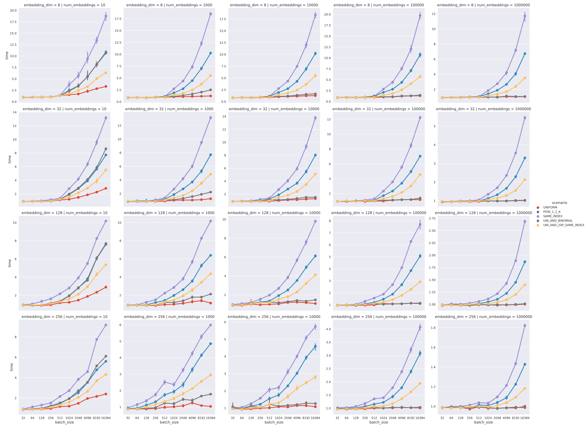
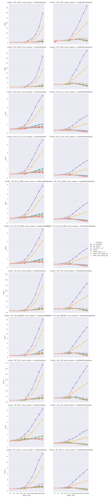

# FastEmbedding

The `FastEmbedding` module is an alternative implementation of `torch.nn.Embedding`.

Modules differ in realization of the backpropagation. `FastEmbedding` avoids sorting and sequential reduction by key by adding
gradients in a naive way using atomic addition. This approach is safe but gives in nondeterministic results, since addition of
floats is not associative.
However, in scenarios with many collisions (i.e. when multiple samples in batch refer to the same embedding) using CUDA `atomicAdd()`
results in significant **(up to 20 times) improvement in training execution time**, especially if dimension of the embedding is small
or moderate.
In other tested scenarios GPU implementation of `FastEmbedding` is at least as fast as `torch.nn.Embedding` when batch size is larger than 128.

Check the [performance benchmark results](#performance-benchmarks) below for more details.

## Installation

The module works with python 3.6 and PyTorch 0.4 only. Due to changes in ATen API, minor changes are needed to use it with PyTorch 0.4.1.

In order to use `FastEmbedding` it is sufficient to execute:

```bash
python3 setup.py install
```

After that module can be imported as follows:

```python
from fast_embedding import FastEmbedding
```

## Usage

Class `FastEmbedding` is an ordinary `torch.nn.Module` and can be used in code almost exactly as the original `torch.nn.Embedding`
module. The constructor of `FastEmbedding` takes two arguments - dictionary size and dimension of embedding.

`FastEmbedding` does not support:
- padding,
- renormalization,
- scaling by frequency,
- nor sparse weights.

One can construct `FastEmbedding` with their own (initial) weight by providing `_weight` argument.

## FastMultiEmbedding

`FastMultiEmbedding` is another `nn.Module` that can be used when there are multiple different embeddings of very small dimension.
This module stores all the weights in a single tensor and performs multiple lookups at once. During tests, when dealing with
10 embeddings of dimensions 1-32 speedups ranging 2-35x were observed.

## Usage

The constructor takes two arguments: list of dictionary sizes and list of embedding dimensions.

`FastMultiEmbedding` module performs lookup and concatenation of _n_ embeddings of dimensions _d<sub>1</sub>_, _d<sub>2</sub>_, ..., _d<sub>n</sub>_.
The input tensor has to be two dimensional with dimensions _batchSize_ x _n_ and the output tensor size will be
_batchSize_ x (_d<sub>1</sub>_ + _d<sub>2</sub>_ + ... + _d<sub>n</sub>_).

For example:

```python
from fast_embedding import FastMultiEmbedding

emb = FastMultiEmbedding([100, 200, 300], [2, 4, 8])
```

is equivalent to:

```python

import torch
import torch.nn as nn

embbeddings = [
    nn.Embedding(100, 2),
    nn.Embedding(200, 4),
    nn.Embedding(300, 8)
]

def emb(batch):
    return torch.cat([
        embbeddings[0](batch[:, 0]),
        embbeddings[1](batch[:, 1]),
        embbeddings[2](batch[:, 2])
    ], 1)

```

## Performance benchmarks

### FastEmbedding

Plots below compare `forward()` + `backward()` execution times of `nn.Embedding` and `FastEmbedding`.

The y-axis represents `nn.Embedding` to `FastEmbedding` execution time ratio.

For more details please refer `tests/test_perf.py`



### FastMultiEmbedding

Plots below compare `forward()` + `backward()` execution times of `nn.Embedding`, `FastEmbedding` and `FastMultiEmbedding`.

The y-axes represent `nn.Embedding` to `FastEmbedding` and `nn.Embedding` to `FastMultiEmbedding` execution time ratios.


